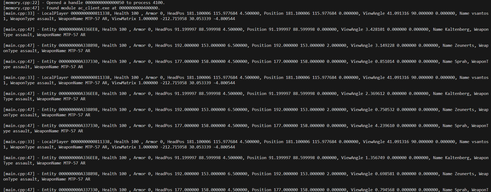

# Art of reversing

> [!NOTE]
> This project is for educational purposes only, helping to understand how hacking in general work.

>Enjoy the process, not the results.

# Tools and knowledge
- [Programming](#basic-programming-knowledge)
- [Code](#code)
- [Reverse Engineering](#reverse-engineering)
## Basic programming knowledge 
- [ASM](https://www.ic.unicamp.br/~pannain/mc404/aulas/pdfs/Art%20Of%20Intel%20x86%20Assembly.pdf) - Programming language
- [C++](https://www.cplusplus.com/doc/tutorial/) - Programming language
- [C](https://www.learn-c.org/) - Programming language
- [Python](https://www.learnpython.org/) - Programming language
- [C#](https://learn.microsoft.com/dotnet/csharp/) - Programming language
- [Rust](https://www.rust-lang.org/learn) - Programming language
- [Go](https://tour.golang.org/welcome/1) - Programming language

## Code
- `Any` Code Editor
- [Cmake](https://cmake.org/) - Build system
- [MSVC](https://visualstudio.microsoft.com/downloads/) - Compiler
## Reverse Engineering

`Tools used`
- [IDA](https://www.hex-rays.com/products/ida/) - Disassembler
- [ReClass.NET](https://github.com/ReClassNET/ReClass.NET) - Memory viewer
- [Cheat Engine](https://www.cheatengine.org/) - Dynamic memory viewer
- [x64/x86dbg](https://x64dbg.com/#start) - Dynamic debugger

`More tools, for reverse engineering, can be found here`
- [RE tools](https://github.com/The-Art-of-Hacking/h4cker/tree/master/reverse_engineering)


## How to build
```bash
git clone
cd folder
run build.bat
```

# Example
Game version `1.3.0.2`

Reversed data and helpers can be found [here](./examples/reversed_helper.h)

Demo logging `process and entities` data.




> [!WARNING]
> if ure learning, try to reverse it yourself and use the file for help `reversed_helper.h`, otherwise just use the file.